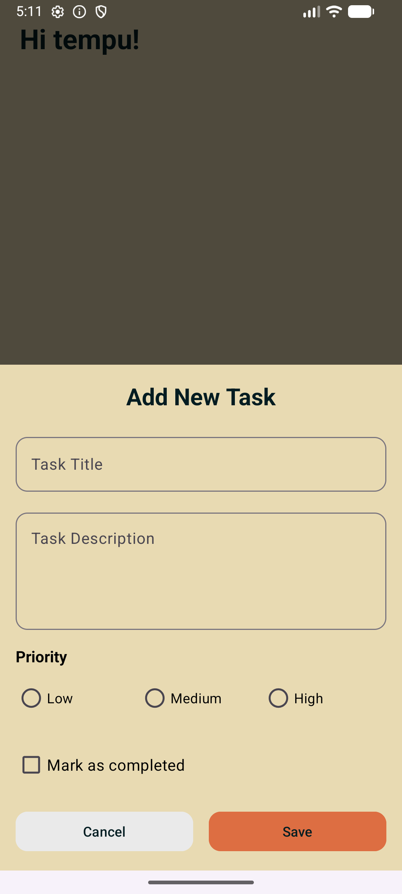
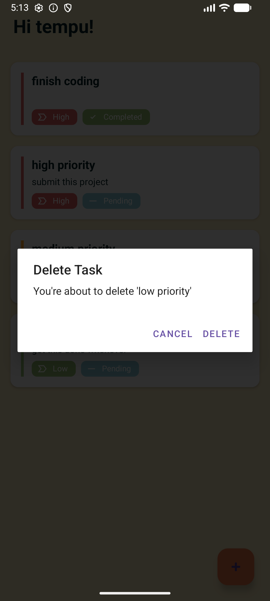
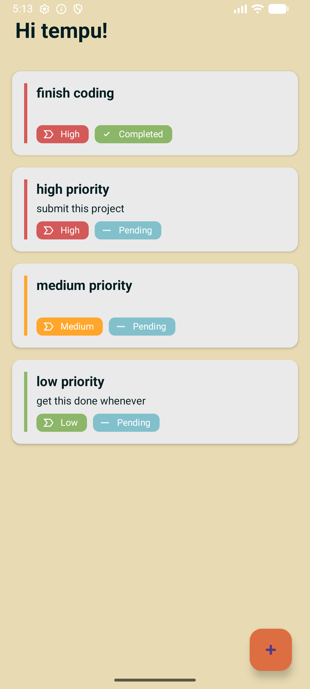
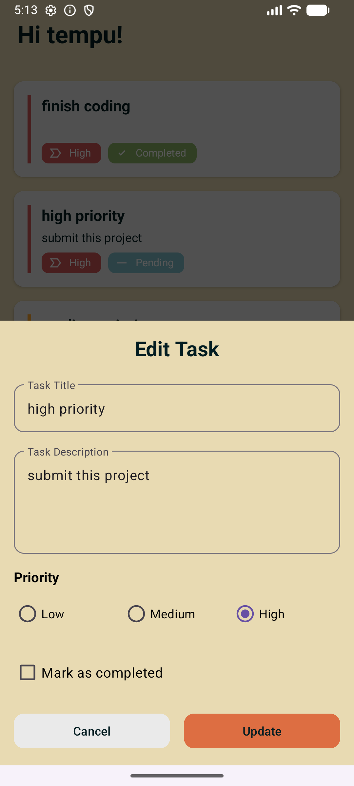

# Toodle

A basic task management app created for the LUT mobile app course.
Currently does not include a ready built .apk. Just a proof of concept that can be built an ran in Android Studio.

Student name:
Jasmin Martens

A demonstration is included here: [follow link](./documentation_assets/toodle_video.webm)
the learning diary can be found here: [follow link](./documentation_assets/learning_diary_martens_jasmin.pdf)

## How to run

1. Clone this repository.
2. Import the project into Android Studio
3. Sync and Build
4. Run the build in the emulator

## Features

- Add a task to the list and choose between three priority status.

- Delete previously created tasks as needed.

- View all currently existing tasks. They will have chips showing their priority and completion status.

- Edit existing task or simply check it off for completion.
